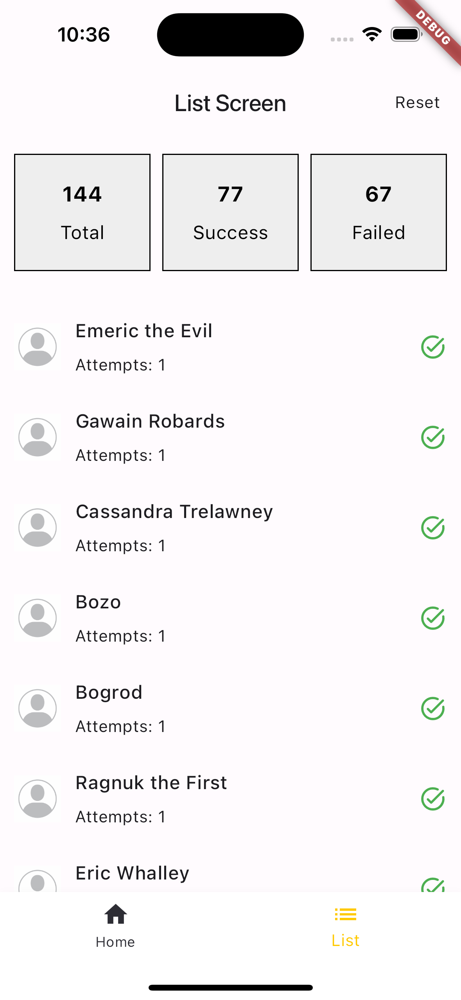

# magic_hat

Hogwarts Sorting Magic Hat Flutter Mobile Application

## Description

The main purpose of this application is to test the user's knowledge of the universe of the Harry Potter movie and the belonging of the heroes of the movie to the clans. The user acts as a magic hat, which guesses the belonging of the characters to a certain clan.

The application also contains a list in which data about his answers are stored, in which he can also view information about the heroes of the film and other data, if the user made a mistake, he will have the opportunity to try to remember again which clan the character belongs to after pressing the "reset" button next to the hero he did not guess. There is also a function to clear the history and check your knowledge again.

# Preview

Home page :

History list if the answers were correct:

Character details :

Screen if the answer was incorrect:

History list if answers were wrong:

